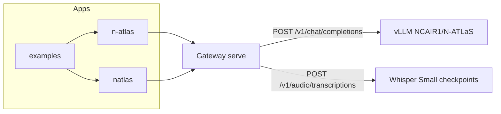

# How the kit uses N-ATLaS

Every inference path in this repository is aimed at `NCAIR1/N-ATLaS` or one of
the four `NCAIR1` ASR repos. There is no fallback vendor.

The diagram is Mermaid source. VitePress shows it as a code block; it is the
same flow as the list below.

## Chat

1. The SDK builds an OpenAI chat body. `model` defaults to `NCAIR1/N-ATLaS`
   and is rejected locally if it does not start with `NCAIR1/`.
2. Optional `language` is normalised to `ha`, `ig`, `yo`, or `en` and sent as
   a non-standard JSON field.
3. The gateway (`prepare_chat_body` in `gateway.py`) deletes `language` so
   vLLM does not 422 on an unknown key, and records the code for the log.
4. The gateway sets `chat_template_kwargs.date_string` to the UTC date in
   `%d %b %Y` form, unless the client already set one or
   `NATLAS_INJECT_DATE_STRING=false`.
5. vLLM renders the template shipped in the model's `tokenizer_config.json`.
   The launcher does not pass `--chat-template`.
6. The response is returned unchanged. Logs keep latency and token counts.
   Message text is not a log field.

`translate`, `summarize`, and `detectLanguage` are step 1 with a fixed English
system prompt, then the same gateway path. `voiceChat` is transcription, then
chat. The transcript is the user message. An empty transcript stops the chain.

## Speech

1. The SDK sends multipart `file`, `language`, and `response_format` to
   `POST /v1/audio/transcriptions`.
2. `normalise_language` maps aliases onto `ha` / `ig` / `yo` / `en`.
3. `settings.asr_models` selects the repo:

   | Code | Repo                             |
   | ---- | -------------------------------- |
   | `ha` | `NCAIR1/Hausa-ASR`               |
   | `ig` | `NCAIR1/Igbo-ASR`                |
   | `yo` | `NCAIR1/Yoruba-ASR`              |
   | `en` | `NCAIR1/NigerianAccentedEnglish` |

4. ffmpeg converts the upload to 16 kHz mono. Audio longer than Whisper's
   30-second window is split near silence (`natlas_serve.audio`).
5. Each chunk is run through that language's checkpoint. The texts are joined
   with spaces.
6. The HTTP response is `{ "text" }` or the verbose fields. The transcript is
   not logged.

On Modal, steps 2–6 run in the gateway container and vLLM is a subprocess on
the GPU. In Docker Compose, the gateway proxies the raw multipart body to the
ASR container, which runs the same router.

## What is intentionally absent

- No OpenAI, Anthropic, or Google SDK in any manifest. CI
  (`.github/workflows/ci.yml`, job `guardrails`) fails the build if one is added.
- `backend="official"` and `backend="local"` raise. They do not silently retarget.
- The playground directory is a separate app. It is not imported by `serve/`
  or the SDKs. When it exists, it is expected to call this same gateway with
  the key kept on the server.

## Keys

| Secret            | Where it lives                                           | Who sees it                                                            |
| ----------------- | -------------------------------------------------------- | ---------------------------------------------------------------------- |
| `HF_TOKEN`        | Modal secret `natlas-hf`, or `.env` on a self-hosted box | The process that downloads weights. Not the browser, not the SDK       |
| `NATLAS_API_KEYS` | Modal secret `natlas-api`, or the gateway environment    | The gateway. Clients send one of those values as `NATLAS_API_KEY`      |
| Request logs      | stdout JSON                                              | A `k_` plus 12 hex chars of SHA-256 of the bearer token, not the token |

Nothing in the docs site build reads these variables.
